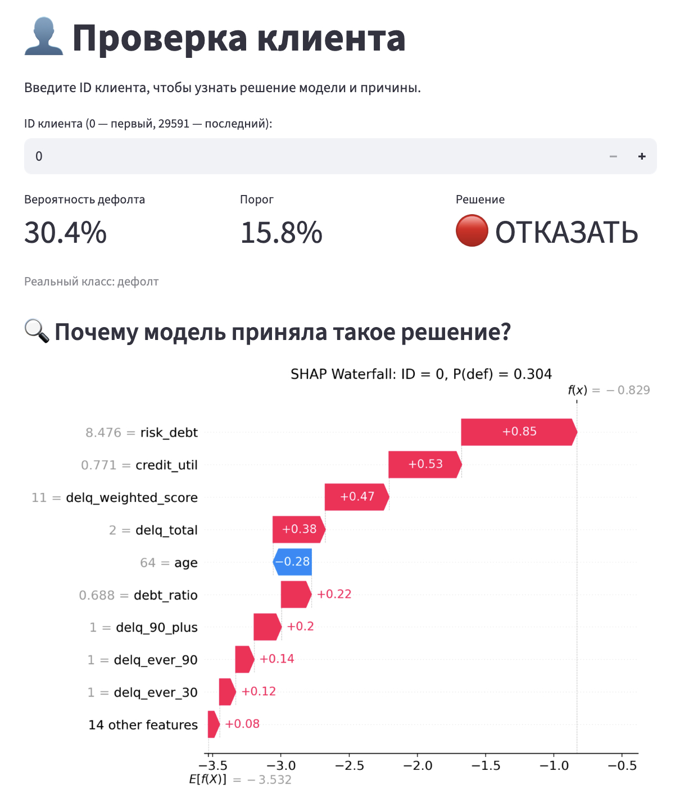

# Кредитный скоринг: прогнозирование дефолтов

## О проекте
Модель для оценки вероятности дефолта заёмщика (просрочка 90+ дней).  
Датасет: Give Me Some Credit (150K записей, 10 базовых признаков, 6.7% дефолтов).

## Ключевые результаты
- **ROC-AUC**: 0.868 (CatBoost)
- **Калибровка**: Калибровочная кривая для честных вероятностей
- **Бизнес-оптимум**: порог 0.159, прибыль на 15% выше baseline
- **Интерпретация**: SHAP-анализ, waterfall-объяснения

## Технологии
Python, Pandas, Scikit-learn, CatBoost, SHAP, Matplotlib

## Интерактивный дашборд

Чтобы сделать результаты работы модели доступными для бизнес-пользователей, я разработал прототип дашборда на `Streamlit`. Он позволяет в реальном времени оценить риск по новому клиенту и понять причины решения.

*Страница оценки конкретного клиента с SHAP-объяснением:*

## Структура
Вся работа — в одном ноутбуке `credit_scoring.ipynb`:
1. Загрузка данных
2. Обработка пропусков
3. Обработка выбросов
4. Feature Engineering (создание новых признаков)
5. Создание модели (CatBoost)
6. Оценка калибровки вероятностей
7. Подбор порога под бизнес задачу
8. SHAP-анализ
9. Бизнес выводы